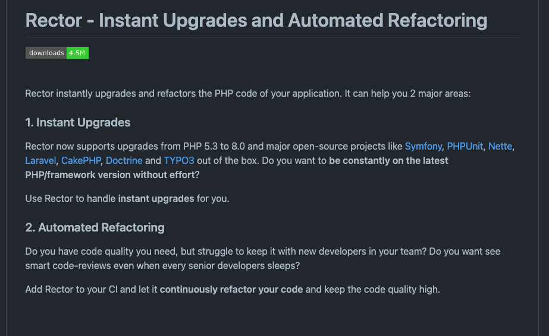
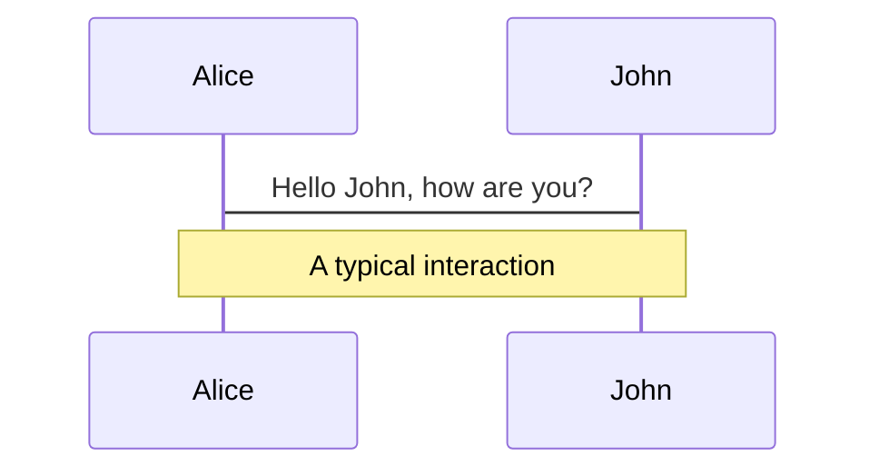
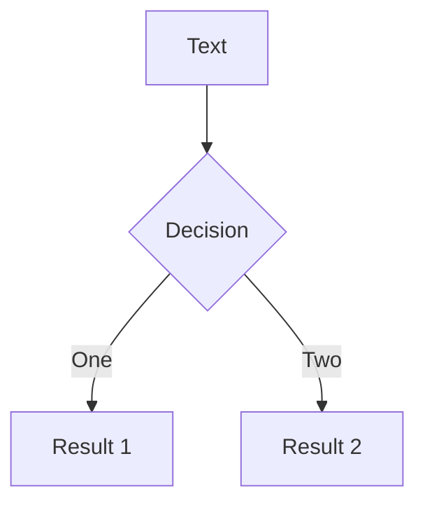
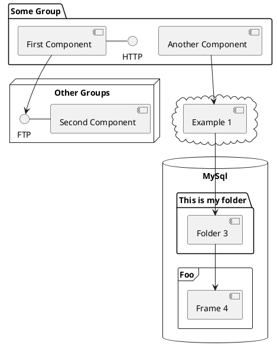

---
# try also 'default' to start simple
theme: unicorn
# random image from a curated Unsplash collection by Anthony
# like them? see https://unsplash.com/collections/94734566/slidev
background: https://source.unsplash.com/collection/94734566/1920x1080
# apply any windi css classes to the current slide
class: 'text-center'
# https://sli.dev/custom/highlighters.html
highlighter: shiki
# show line numbers in code blocks
lineNumbers: false
# some information about the slides, markdown enabled
info: |
  ## Slidev Starter Template
  Presentation slides for developers.

  Learn more at [Sli.dev](https://sli.dev)
# persist drawings in exports and build
drawings:
  persist: false

layout: intro
logoHeader: './images/techtrain.jpg'
website: 'https://github.com/SuguruOoki'
handle: 'suguru_ohki'
introImage: 'https://avatars.githubusercontent.com/u/16362021?v=4'

---

# Laravel9へ！

<div>
  <h3>Laravel9がリリースされます!2021/01予定ですが、振り返りをしてみましょう。</h3>
</div>

---

# Laravel9での把握すべきこと

---

## 概要

1. PHP 8.0 が最低限必要
2. Symfony6系を利用している
3. 次のLTSとなる

|   version    | release date              |
| :----------: | :------------------------ |
| Laravel 9.0  | 2022年1月（January 2022） |
| Laravel 10.0 | 2023年1月（January 2023） |
| Laravel 11.0 | 2024年1月（January 2024） |

---

### 機能

|                                               |                                                                                                                                 |
| --------------------------------------------- | ------------------------------------------------------------------------------------------------------------------------------- |
| <kbd>Anonymous Migration</kbd>                | Migration自体にそれぞれ名前をつける必要ない                                                                                     |
| <kbd>New Query Builder Interface</kbd>        | 「Query\Builder」「Eloquent\Builder」「Eloquent\Relation」の勘違いを減らす                                                      |
| <kbd>PHP 8 String Functions</kbd>             | \Illuminate\Support\Strクラスの内部でのstr_contains() 、 str_starts_with() 、およびstr_ends_with()のphpの標準関数の利用が始まる |
| <kbd>From SwiftMailer to Symfony Mailer</kbd> | SymfonyがSwiftMailerを非推奨になったため、その解消                                                                              |

---

# Anonymous Migration

---

そもそもMigration自体にそれぞれ名前をつける必要があるんだっけ？という疑問から生まれた機能。

[該当Issueはこちら](https://github.com/laravel/framework/issues/5899)で参考の書き方は次のとおり。

```php
<?php

use Illuminate\Database\Migrations\Migration;
use Illuminate\Database\Schema\Blueprint;
use Illuminate\Support\Facades\Schema;
return new class extends Migration {
    /**
     * Run the migrations.
     *
     * @return void
     */
    public function up()
    {
        Schema::table('people', function (Blueprint $table)
        {
            $table->string('first_name')->nullable();
        });
    }
};
```

---

### Before

```php {all|7}
<?php

use Illuminate\Database\Migrations\Migration;
use Illuminate\Database\Schema\Blueprint;
use Illuminate\Support\Facades\Schema;

class AddColumnFirstNameInPeopleTable extends Migration
{
    /**
     * Run the migrations.
     *
     * @return void
     */
    public function up()
    {
        Schema::table('people', function (Blueprint $table) {
            $table->string('first_name')->nullable();
        });
    }
};
```

<arrow v-click="4" x1="400" y1="420" x2="230" y2="240" color="#564" width="3" arrowSize="1" />

---

### After

```php {all|2|7|7}
<?php

use Illuminate\Database\Migrations\Migration;
use Illuminate\Database\Schema\Blueprint;
use Illuminate\Support\Facades\Schema;

return new class extends Migration {
    /**
     * Run the migrations.
     *
     * @return void
     */
    public function up()
    {
        Schema::table('people', function (Blueprint $table)
        {
            $table->string('first_name')->nullable();
        });
    }
};
```

<arrow v-click="4" x1="400" y1="420" x2="230" y2="240" color="#564" width="3" arrowSize="1" />

---

# New Query Builder Interface

---

クエリビルダインターフェースが提供されるようになる。これにより補完周りがかなり便利に。
[こちら](https://github.com/laravel/framework/pull/37956) のプルリクエストにもあるように、補完が効いているときに、「Query\Builder」なのか「Eloquent\Builder」なのか「Eloquent\Relation」なのかによって補完が間違っているせいで一度エラーが出たなんて経験がある程度補完を使ったことがある人なら誰しもあるはず。そのエラーが出なくなるらしい。


```php
<?php

return Model::query()
	->whereNotExists(function($query) {
		// $query is a Query\Builder
	})
	->whereHas('relation', function($query) {
		// $query is an Eloquent\Builder
	})
	->with('relation', function($query) {
		// $query is an Eloquent\Relation
	});
```

---

# PHP 8 String Functions

---

\Illuminate\Support\Strクラスの内部での

* str_contains()
* str_starts_with()
* str_ends_with()

のphpの標準関数の利用が始まる。今までphpの標準関数に文字列の中に特定nの文字が含まれるのかなどといった関数がなかったため、Laravelでは、独自のラッパーメソッドを実装していた。今回でその独自実装でなくなり、標準関数の利用が始まる

プルリクエストは [こちら](https://github.com/laravel/framework/pull/38011)

```
Since PHP 8 will be the minimum, Tom Schlick submitted a PR to move to using str_contains(), str_starts_with() and str_ends_with() functions internally in the \Illuminate\Support\Str class.
```

---

# From SwiftMailer to Symfony Mailer

---


プルリクエストは[こちら](https://github.com/laravel/framework/pull/38481)

SymfonyがSwiftMailerを非推奨としたため、Laravel9で、すべてのメールトランスポートにSymfonyMailerを使用するように変更された

```
Symfony deprecated SwiftMailer and Laravel 9 makes the change to use Symfony Mailer for all the mail transports. This does open up a few breaking changes and you can review the PR for all the details. The Laravel 9 upgrade guide will include instructions once it's officially released.
```

---

# アップデートの鬼門

---

## LTSにおけるアップデート(6.x -> 9.x)について

1. Laravel8での変更が鬼門となりそう
2. モデルファクトリが8からクラスベースの書き方に変更があった。
3. しばらくは一旦ヘルパーで捌けるとはいえ、長期的なことを考えると、書き換えておいた方が良さそう

---

## Before

```php
<?php

/** @var \Illuminate\Database\Eloquent\Factory $factory */

use App\Models\User;
use Faker\Generator as Faker;
use Illuminate\Support\Str;

$factory->define(User::class, function (Faker $faker) {
    return [
        'name' => $faker->name,
        'email' => $faker->unique()->safeEmail,
        'email_verified_at' => now(),
        'password' => '$2y$10$92IXUNpkjO0rOQ5byMi.Ye4oKoEa3Ro9llC/.og/at2.uheWG/igi', // password
        'remember_token' => Str::random(10),
    ];
});
```

---

## After

```php
use Illuminate\Database\Eloquent\Factories\Factory;

class UserFactory extends Factory
{
    protected $model = User::class;
    public function definition()
    {
        return [
            'name' => $this->faker->name,
            'email' => $this->faker->unique()->safeEmail,
            'email_verified_at' => now(),
            'password' => '$2y$10$92IXUNpkjO0rOQ5byMi.Ye4oKoEa3Ro9llC/.og/at2.uheWG/igi', // password
            'remember_token' => Str::random(10),
        ];
    }
}
```


1. HasFactoryのtraitをModelに入れる必要がある
2. ファクトリにネームスペースが付くため、ネームスペースをcomposer.jsonに追加

---

## Rectorを使って乗り越えられるかもしれない。

---

## Rector とは

https://github.com/rectorphp/rector




---


[カオナビさんの素晴らしいアドベントカレンダー](https://zenn.dev/naopusyu/articles/cc68a0aa827bca)


---

<style>
h1 {
  background-color: #2B90B6;
  background-image: linear-gradient(45deg, #4EC5D4 10%, #146b8c 20%);
  background-size: 100%;
  -webkit-background-clip: text;
  -moz-background-clip: text;
  -webkit-text-fill-color: transparent;
  -moz-text-fill-color: transparent;
}
</style>

---

# Navigation

Hover on the bottom-left corner to see the navigation's controls panel, [learn more](https://sli.dev/guide/navigation.html)

### Keyboard Shortcuts

|                                                     |                             |
| --------------------------------------------------- | --------------------------- |
| <kbd>right</kbd> / <kbd>space</kbd>                 | next animation or slide     |
| <kbd>left</kbd>  / <kbd>shift</kbd><kbd>space</kbd> | previous animation or slide |
| <kbd>up</kbd>                                       | previous slide              |
| <kbd>down</kbd>                                     | next slide                  |

<!-- https://sli.dev/guide/animations.html#click-animations -->

<p v-after class="absolute bottom-23 left-45 opacity-30 transform -rotate-10">Here!</p>

---
layout: image-right
image: https://source.unsplash.com/collection/94734566/1920x1080
---

# Code

Use code snippets and get the highlighting directly![^1]

```ts {all|2|1-6|9|all}
interface User {
  id: number
  firstName: string
  lastName: string
  role: string
}

function updateUser(id: number, update: User) {
  const user = getUser(id)
  const newUser = {...user, ...update}
  saveUser(id, newUser)
}
```

<arrow v-click="3" x1="400" y1="420" x2="230" y2="330" color="#564" width="3" arrowSize="1" />

[^1]: [Learn More](https://sli.dev/guide/syntax.html#line-highlighting)

<style>
.footnotes-sep {
  @apply mt-20 opacity-10;
}
.footnotes {
  @apply text-sm opacity-75;
}
.footnote-backref {
  display: none;
}
</style>

---

# Components

<div grid="~ cols-2 gap-4">
<div>

You can use Vue components directly inside your slides.

We have provided a few built-in components like `<Tweet/>` and `<Youtube/>` that you can use directly. And adding your custom components is also super easy.

```html
<Counter :count="10" />
```

<!-- ./components/Counter.vue -->
<Counter :count="10" m="t-4" />

Check out [the guides](https://sli.dev/builtin/components.html) for more.

</div>
<div>

```html
<Tweet id="1390115482657726468" />
```

<Tweet id="1390115482657726468" scale="0.65" />

</div>
</div>


---
class: px-20
---

# Themes

Slidev comes with powerful theming support. Themes can provide styles, layouts, components, or even configurations for tools. Switching between themes by just **one edit** in your frontmatter:

<div grid="~ cols-2 gap-2" m="-t-2">

```yaml
---
theme: default
---
```

```yaml
---
theme: seriph
---
```


</div>

Read more about [How to use a theme](https://sli.dev/themes/use.html) and
check out the [Awesome Themes Gallery](https://sli.dev/themes/gallery.html).

---
preload: false
---

# Animations

Animations are powered by [@vueuse/motion](https://motion.vueuse.org/).

```html
<div
  v-motion
  :initial="{ x: -80 }"
  :enter="{ x: 0 }">
  Slidev
</div>
```

<div class="w-60 relative mt-6">
  <div class="relative w-40 h-40">
    
    
    
  </div>

  <div
    class="text-5xl absolute top-14 left-40 text-[#2B90B6] -z-1"
    v-motion
    :initial="{ x: -80, opacity: 0}"
    :enter="{ x: 0, opacity: 1, transition: { delay: 2000, duration: 1000 } }">
    Slidev
  </div>
</div>

<!-- vue script setup scripts can be directly used in markdown, and will only affects current page -->
<script setup lang="ts">
const final = {
  x: 0,
  y: 0,
  rotate: 0,
  scale: 1,
  transition: {
    type: 'spring',
    damping: 10,
    stiffness: 20,
    mass: 2
  }
}
</script>

<div
  v-motion
  :initial="{ x:35, y: 40, opacity: 0}"
  :enter="{ y: 0, opacity: 1, transition: { delay: 3500 } }">

[Learn More](https://sli.dev/guide/animations.html#motion)

</div>

---

# LaTeX

LaTeX is supported out-of-box powered by [KaTeX](https://katex.org/).

<br>

Inline $\sqrt{3x-1}+(1+x)^2$

Block
$$
\begin{array}{c}

\nabla \times \vec{\mathbf{B}} -\, \frac1c\, \frac{\partial\vec{\mathbf{E}}}{\partial t} &
= \frac{4\pi}{c}\vec{\mathbf{j}}    \nabla \cdot \vec{\mathbf{E}} & = 4 \pi \rho \\

\nabla \times \vec{\mathbf{E}}\, +\, \frac1c\, \frac{\partial\vec{\mathbf{B}}}{\partial t} & = \vec{\mathbf{0}} \\

\nabla \cdot \vec{\mathbf{B}} & = 0

\end{array}
$$

<br>

[Learn more](https://sli.dev/guide/syntax#latex)

---

# Diagrams

You can create diagrams / graphs from textual descriptions, directly in your Markdown.

<div class="grid grid-cols-3 gap-10 pt-4 -mb-6">







</div>

[Learn More](https://sli.dev/guide/syntax.html#diagrams)


---
layout: center
class: text-center
---

# Learn More

[Documentations](https://sli.dev) · [GitHub](https://github.com/slidevjs/slidev) · [Showcases](https://sli.dev/showcases.html)
